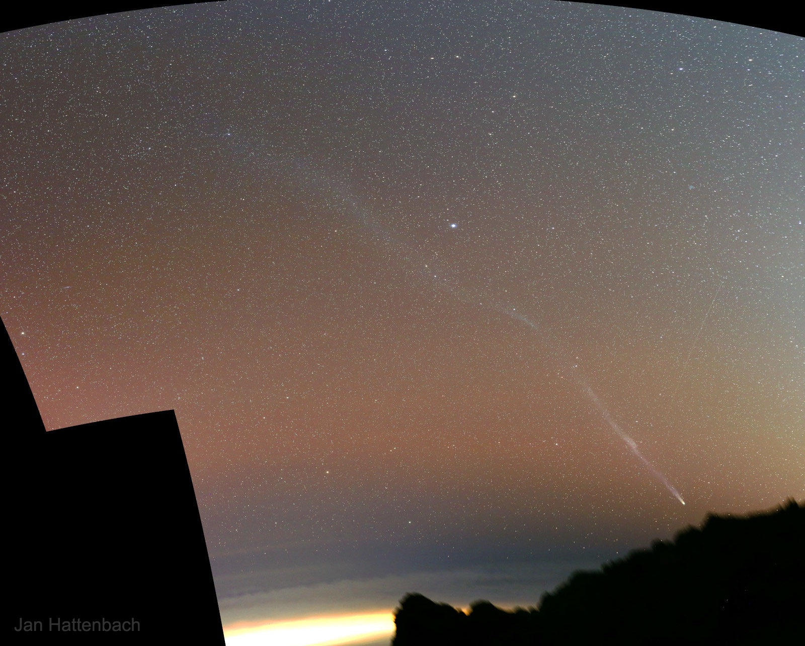

<!-- You are a curios one 🔍 -->
### Hi there 👋 
#### While you are here have a look at NASAs picture of the day 🔭
**Credit:** Tamas Ladanyi   
   

**Explanation:** That's not a young crescent Moon posing behind cathedral towers after sunset. It's Venus in a crescent phase. About 40 million kilometers away and about 2 percent illuminated by sunlight, it was captured with camera and telephoto lens in this series of exposures as it set in western skies on January 1 from Veszprem, Hungary. The bright celestial beacon was languishing in the evening twilight, its days as the Evening Star coming to a close as 2022 began. But it was also growing larger in apparent size and becoming an ever thinner crescent in telescopic views. Heading toward a (non-judgemental) inferior conjunction, the inner planet will be positioned between Earth and Sun on January 9 and generally lost from view in the solar glare. A crescent Venus will soon reappear though. Rising in the east by mid-month just before the Sun as the brilliant Morning Star.   Status Updates: Deploying the James Webb Space Telescope