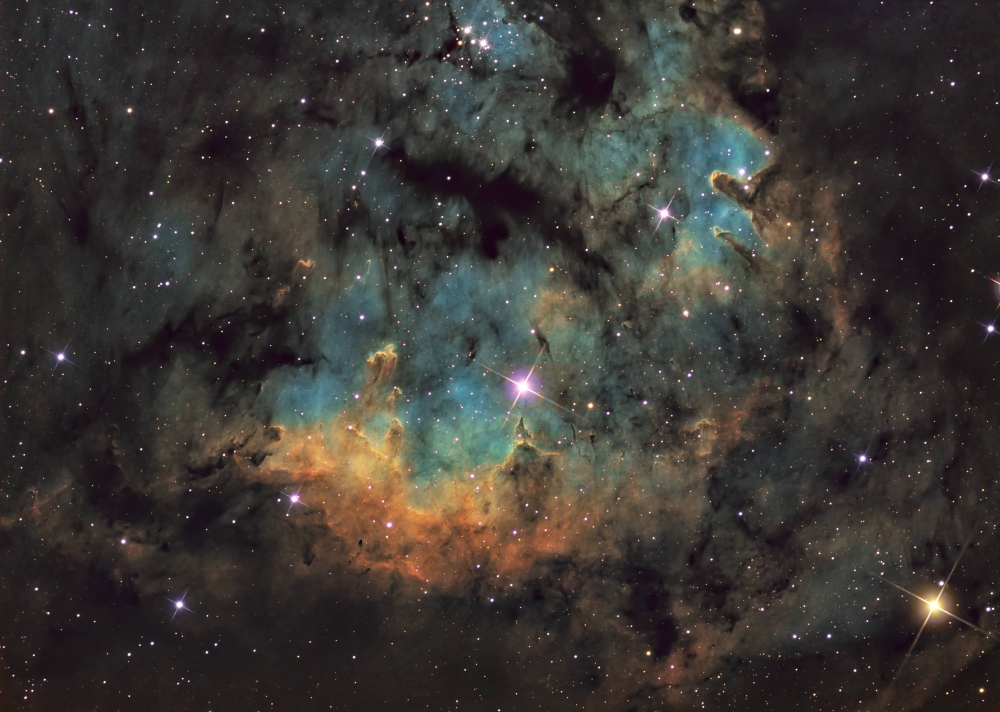

<!-- You are a curios one 🔍 -->
### Hi there 👋 
#### While you are here have a look at NASAs picture of the day 🔭
**Credit:** Mark Hanson   
   

**Explanation:** An island universe of billions of stars, NGC 1566 lies about 60 million light-years away in the southern constellation Dorado. Popularly known as the Spanish Dancer galaxy, it's seen face-on from our Milky Way perspective. A gorgeous grand design spiral, this galaxy's two graceful spiral arms span over 100,000 light-years, traced by bright blue star clusters, pinkish starforming regions, and swirling cosmic dust lanes. NGC 1566's flaring center makes the spiral one of the closest and brightest Seyfert galaxies. It likely houses a central supermassive black hole wreaking havoc on surrounding stars, gas, and dust. In this sharp southern galaxy portrait, the spiky stars lie well within the Milky Way.